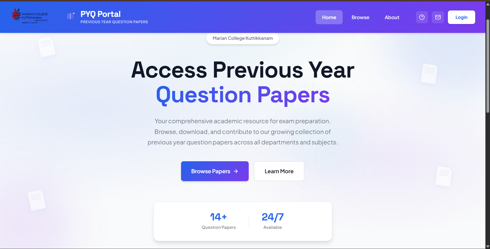
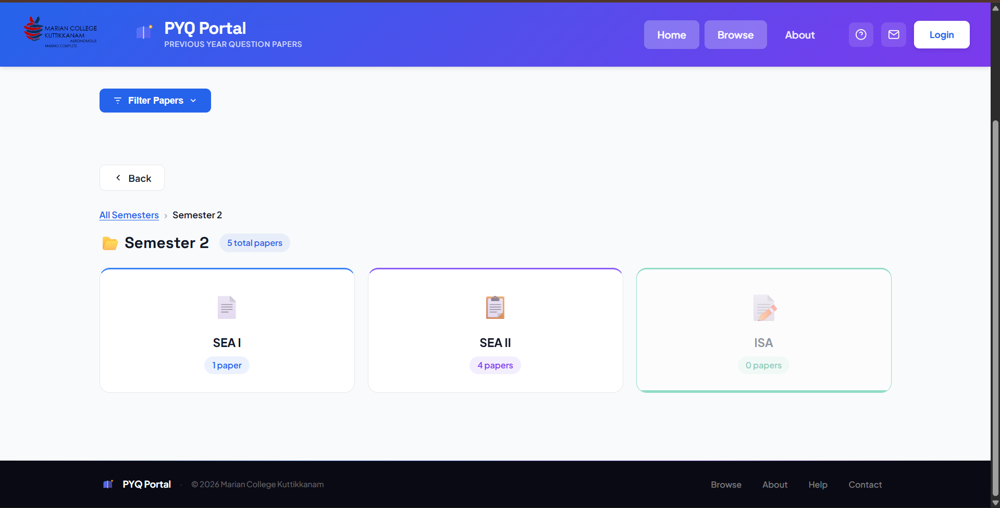
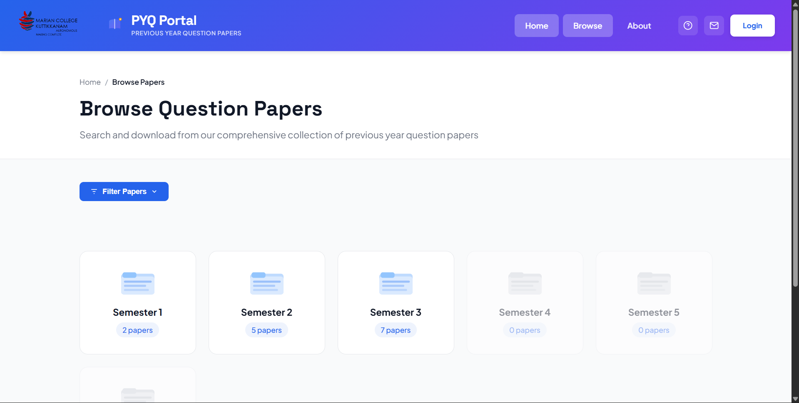
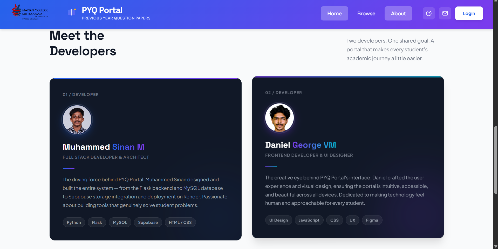

# 📚 PYQ Portal — Previous Year Question Papers

> **Built by BCA students, for BCA students.**  
> A free, fast, and always-available archive of previous year question papers — designed to make every junior student's exam preparation a little easier.

<br/>


<br/>

## 🌐 Live Demo

**[pyqportal.app](https://pyqportal.app)** — Open. Free. No login required to browse.

<br/>

## 📸 Screenshots

<p>
  
  
</p>
<p>
  
  
</p>
## ✨ Features

- 📁 **Semester-based folder navigation** — Papers organized by Semester 1 to 6
- 📋 **Exam type filtering** — Browse SEA I, SEA II, and ISA papers separately
- 🔍 **Search and filter** — Filter by subject, year, semester or search by keyword
- 📄 **Inline PDF preview** — View papers directly in browser — no forced downloads
- 📱 **Fully mobile responsive** — Works perfectly on all screen sizes
- 🔒 **Admin-only upload** — Secure admin panel to upload and manage papers
- ⚡ **Always available** — Hosted 24/7, no sleeping, no delays
- 🆓 **Completely free** — No login needed to browse and download

<br/>

## 🛠️ Tech Stack

| Layer | Technology |
|---|---|
| Backend | Python · Flask |
| Database | Supabase PostgreSQL |
| File Storage | Supabase Storage |
| Frontend | HTML · CSS · JavaScript |
| Production Server | Gunicorn |
| Hosting | Render |
| Fonts | Plus Jakarta Sans · Space Grotesk |

<br/>

## 🗂️ Project Structure

```
pyq-portal/
├── app.py                  # Main Flask application
├── requirements.txt        # Python dependencies
├── Procfile               # Gunicorn start command
├── runtime.txt            # Python version
├── static/
│   ├── style.css          # Main styles
│   ├── style-combined.css # Component styles
│   ├── script.js          # Shared scripts
│   ├── indexjs.js         # Home page scripts
│   ├── viewjs.js          # Browse page scripts
│   └── uploadjs.js        # Upload page scripts
└── templates/
    ├── index.html         # Home page
    ├── view.html          # Browse papers page
    ├── upload.html        # Admin upload page
    ├── about.html         # About page
    └── login.html         # Admin login page
```

<br/>


## 🚀 Local Development

**1. Clone the repository**
```bash
git clone https://github.com/YOUR_USERNAME/pyq-portal.git
cd pyq-portal
```

**2. Create virtual environment**
```bash
python3 -m venv venv
source venv/bin/activate       # Mac/Linux
venv\Scripts\activate          # Windows
```

**3. Install dependencies**
```bash
pip install -r requirements.txt
```

**4. Set up environment variables**
```bash
cp .env.example .env
# Fill in your values in .env
```

**5. Run the app**
```bash
python app.py
```

Open `http://localhost:10000` in your browser.

<br/>


## ☁️ Deployment (Render)

**1.** Push your code to GitHub

**2.** Create a new Web Service on [render.com](https://render.com)

**3.** Connect your GitHub repository

**4.** Set these in Render → Environment:
```
DATABASE_URL, SUPABASE_URL, SUPABASE_KEY,
SUPABASE_BUCKET, SECRET_KEY, ADMIN_USER, ADMIN_PASS
```

**5.** Set Start Command:
```
gunicorn app:app --bind 0.0.0.0:$PORT --workers 1 --timeout 120 --keep-alive 5
```

**6.** Deploy — your portal will be live at your Render URL!


## 👨‍💻 Developers

This portal was built by two **BCA 3rd Year students** from Marian College Kuttikkanam — as a real-world project to help their juniors study smarter.

<table>
  <tr>
    <td align="center">
      <strong>Muhammed Sinan M</strong><br/>
      Full Stack Developer & Architect<br/>
      <sub>Flask · Python · PostgreSQL · Supabase · HTML/CSS</sub><br/>
      <sub>Designed and built the entire backend system, database architecture, storage integration and deployment</sub>
    </td>
    <td align="center">
      <strong>Daniel George VM</strong><br/>
      Frontend Developer & UI Designer<br/>
      <sub>JavaScript · CSS · UI Design · UX · Figma</sub><br/>
      <sub>Crafted the user experience and visual design — making the portal intuitive and beautiful across all devices</sub>
    </td>
  </tr>
</table>

> 📍 **Marian College Kuttikkanam** (Autonomous) · BCA Department · Kerala, India · Batch 2023–2026

<br/>

## 🎯 Why We Built This

As BCA students ourselves, we experienced the frustration firsthand — previous year question papers were **scattered, hard to find, and unavailable** exactly when we needed them most.

We built PYQ Portal to change that. A clean, fast, and permanently free archive — so that every junior student at Marian College has one less thing to worry about before exams.

> *"We believe every student deserves access to quality study resources — without barriers, without cost."*

<br/>

## 📄 License

This project was built as a student initiative at Marian College Kuttikkanam.  
All rights reserved © 2026 Muhammed Sinan M & Daniel George VM.

Feel free to take inspiration — but please don't copy and deploy as your own.

<br/>

## 🙏 Acknowledgements

- **Marian College Kuttikkanam** — for being an institution that encourages students to build real things
- **Supabase** — for the generous free tier that makes this project possible
- **Render** — for free hosting that keeps the portal always alive

<br/>

---

<p align="center">
  <a href="https://pyqportal.app">🌐 Live Site</a>
</p>
